# Vision Transformer (ViT) from Scratch
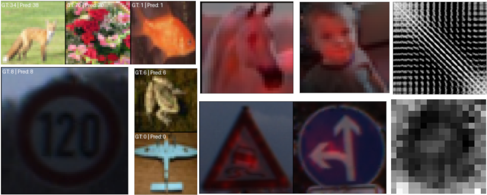

## Introduction
A clean PyTorch re-implementation of the Vision Transformer (ViT) from scratch, introduced in “An Image Is Worth 16×16 Words: Transformers for Image Recognition at Scale” (ICLR 2021).

- The codebase is designed to be easy to train, modify, and extend. 
- Everything is **fully configurable**, including ViT model architecture, optimization settings, data pipeline components, training hyperparameters, etc.
- A wide range of visualization features, from metrics like precision, recall, loss, F1 score, and accuracy, and learning rate curves to qualitative visualizations of model predictions, attention maps (CLS-to-patch attention), and positional embedding representations (similarity maps and magnitude heatmaps).


## Quick Installation

### 1. Create a virtual environment

``` bash
make venv
```

### 2. Activate it

``` bash
source .venv/bin/activate
```

### 3. Install Dependencies and CUDA-Enabled PyTorch

``` bash
make install-gpu
make install-dev
```
If you want to change the version of cuda enabled torch (currently CUDA 12.8), you can modify install-gpu section in `Makefile`.

### 4. Verify GPU support

``` bash
make check-gpu
```

## How To Use

### Training
After installing the project, you can start training using the `vit train` command. The training CLI is fully configuration-driven and allows you to override any field in the default experiment configs located in `src/vision_transformer/config/` via the `--set section.field=value` syntax. Multiple --set flags can be provided to customize the run without editing code. For example, the command below trains a Vision Transformer under the default configuration, with overrides for input image size (448), training duration (100 epochs), learning rate (3e-4), and Adam optimizer betas (0.9,0.98).

```python
vit train \
  --set model.image_size=448 \
  --set training.epochs=100 \
  --set optimizer.lr=3e-4 \
  --set optimizer.betas=0.9,0.98
```

Also, stop training can be resumed, just pass the path to saved checkpoint, for example:
```python
vit train \
  --set training.resume_path="./checkpoints/2026-02-07_21-53-15/last.pth"
```

For **practical examples**, please refer to the `scripts/` folder.

To visualize training metrics such as loss and accuracy, launch TensorBoard with: 
```bash
tensorboard --logdir=runs
```

## Results

I trained ViT models from scratch on `CIFAR-100`, `CIFAR-10` and `German Traffic Sign Recognition Dataset (GTSRB)`. To do the same, you can run follwoing files: `scripts/training-cifar-100.sh`, `scripts/training-cifar-10.sh`, and `scripts/training-GTSRB.sh`.

In the following sections, I report the test accuracy, along with visualizations of model predictions, attention maps (CLS-to-patch attention), and positional embedding representations (similarity maps and magnitude heatmaps).

- The **prediction visualizations** show example inputs with their ground-truth and predicted labels, giving a qualitative sense of model performance. 
- The **CLS-to-patch attention maps** highlight which image regions the model focuses on when making a classification decision. 
- The **positional embedding similarity maps** illustrate how spatial tokens relate to each other in embedding space, while the **magnitude (norm) maps** show how strongly each spatial position is encoded. 

Together, all these visualizations provide insight into both what the model learns and how it makes decisions. 


### CIFAR-100

-   **Test Accuracy:** 59.74%

#### Sample Predictions

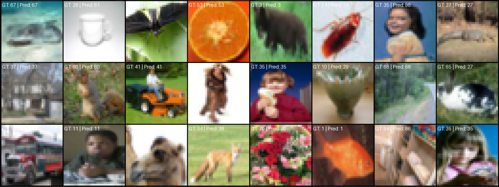

#### Attention Visualization (CLS - Patches)

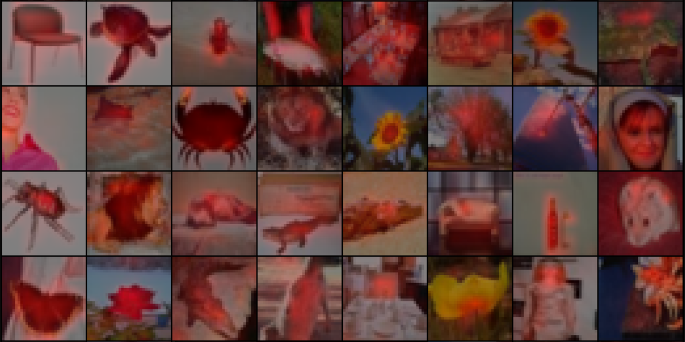

#### Positional Embeddings Visualization

| **Similarity Map** | **Magnitude (Norm) Map** |
|--------------------|--------------------------|
| 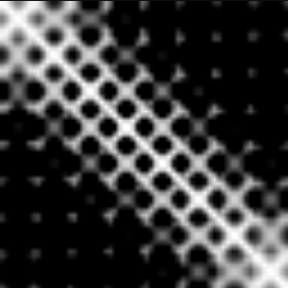 | 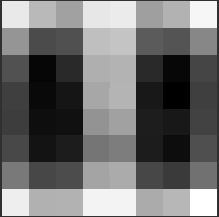 |


------------------------------------------------------------------------


### CIFAR-10

-   **Test Accuracy:** 85.47%

#### Sample Predictions

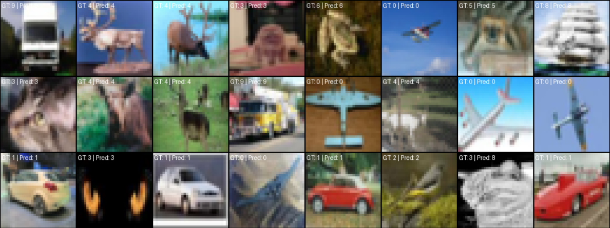

#### Attention Visualization (CLS - Patches)


#### Positional Embeddings Visualization

| **Similarity Map** | **Magnitude (Norm) Map** |
|--------------------|--------------------------|
| 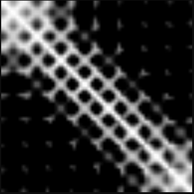 | 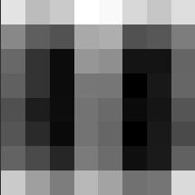 |


------------------------------------------------------------------------

### German Traffic Sign Recognition Benchmark (GTSRB)

-   **Test Accuracy:** 98.3%

#### Sample Predictions

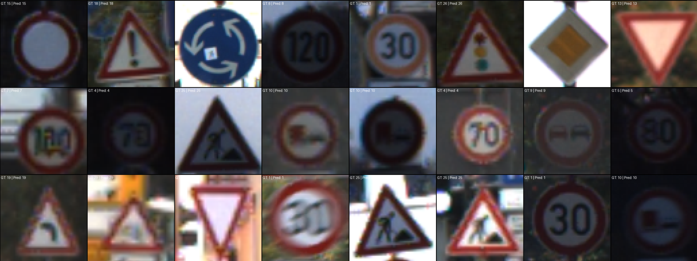

#### Attention Visualization (CLS - Patches)

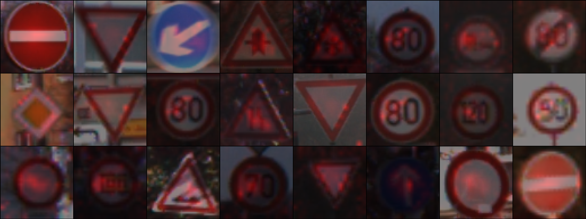

#### Positional Embeddings Visualization

| **Similarity Map** | **Magnitude (Norm) Map** |
|--------------------|--------------------------|
| 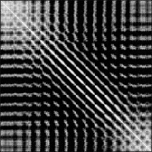 | 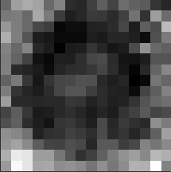 |

------------------------------------------------------------------------


## License
Released under the MIT License. For used datasets, please check their respective licenses.

## References
```
- Dosovitskiy, Alexey. "An image is worth 16x16 words: Transformers for image recognition at scale." arXiv preprint arXiv:2010.11929 (2020).
```
